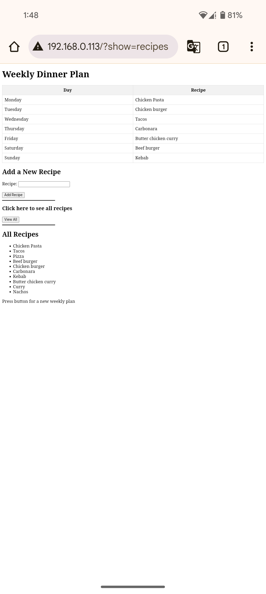

## Weekly dinner planner

---

Every week me and my partner ask each other "What do you want to eat this week?" and the answer is always the same "I don't know."  
To solve this I decided to build an automated tool that generates a random weekly plan of dinner ideas. 
The motivation to start this project was for me wanting to experiment with C++ more and also build another IoT device using an Arduino nano ESP32 I had lying around.
  The main idea of this is for the Nano to host a web server on my local network and when a connected button is pressed the page updates with a new list of dinner recipes for each day of the week 
To create the database of recipes to be selected from I added in an "Add Recipe" section so when I make something we want again it can be added to the list of recipes to choose from.

--- 
### Current Progress

- **Main page**  The main page of the site is running and when the button is pressed the table is refreshed with a selection of random recipes.

- **Arduino**  the Nano is running a web server and uses a physical button to refresh the page and update the weekly recipes It currently stores them in a vector so more can be added but this is causing problems with the code not actually updating so only the hard coded vector is being used.

---

### Next Steps

- **Storage**  Replace the vector with a SQLite database to store and retrieve the recipes, make sure this can be updated with new recipes and can still be randomly inputted to the table
--- 
### Images

  

